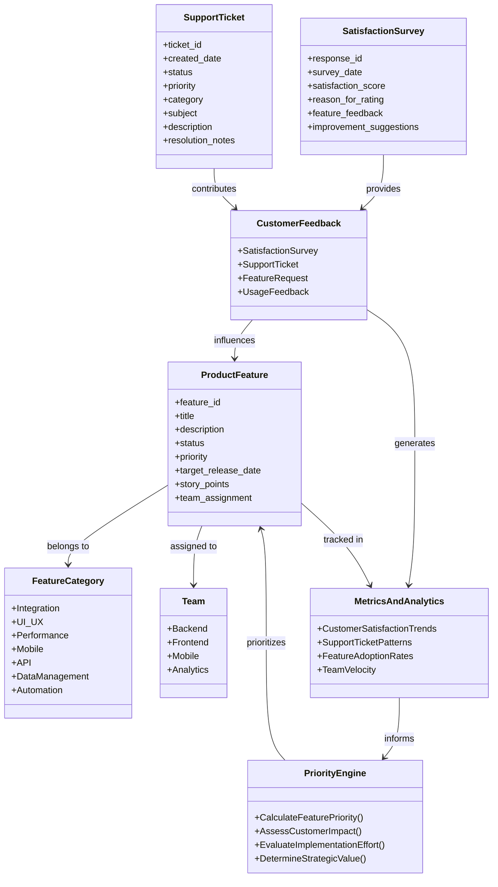

# Project Dreyfus Ontology

## Overview
This document defines the central ontology for Project Dreyfus, providing a formal knowledge representation framework that captures the relationships between customer feedback, product features, development processes, and strategic decision-making. The ontology is designed to support AI-driven product management by establishing clear relationships and rules for data integration and analysis.

## Purpose
- Enable data-driven product decisions through structured knowledge representation
- Facilitate integration of multiple feedback channels
- Support automated priority calculations and feature recommendations
- Provide a foundation for AI model training and inference
- Guide implementation of data pipelines and analytics

## Core Concepts and Relationships



## Detailed Component Specifications

### 1. CustomerFeedback
Primary entity for aggregating all forms of customer input and feedback.

#### SatisfactionSurvey
- **Purpose**: Capture structured customer satisfaction data
- **Key Attributes**:
  - response_id: Unique identifier
  - survey_date: Date of response
  - satisfaction_score: 1-5 rating
  - reason_for_rating: Primary reason for score
  - feature_feedback: Specific feature comments
  - improvement_suggestions: Future enhancement ideas

#### SupportTicket
- **Purpose**: Track customer issues and support requests
- **Key Attributes**:
  - ticket_id: Unique identifier
  - created_date: Creation timestamp
  - status: Current ticket status
  - priority: Issue urgency level
  - category: Issue classification
  - subject: Brief description
  - description: Detailed issue description
  - resolution_notes: Solution details

### 2. ProductFeature
Represents individual product features or enhancements.

- **Key Attributes**:
  - feature_id: Unique identifier
  - title: Feature name
  - description: Detailed description
  - status: Current development status
  - priority: Implementation priority
  - target_release_date: Planned release
  - story_points: Effort estimation
  - team_assignment: Responsible team

### 3. FeatureCategory
Classification system for product features.

- **Categories**:
  - Integration: External system connections
  - UI_UX: User interface and experience
  - Performance: System optimization
  - Mobile: Mobile app features
  - API: API functionality
  - DataManagement: Data handling features
  - Automation: Automated workflows

### 4. Team
Organizational structure for development teams.

- **Teams**:
  - Backend: Server-side development
  - Frontend: Client-side development
  - Mobile: Mobile app development
  - Analytics: Data analysis and reporting

### 5. MetricsAndAnalytics
System for tracking and analyzing product and development metrics.

- **Key Metrics**:
  - CustomerSatisfactionTrends: CSAT patterns
  - SupportTicketPatterns: Issue frequency analysis
  - FeatureAdoptionRates: Usage statistics
  - TeamVelocity: Development speed metrics

### 6. PriorityEngine
Algorithmic system for feature prioritization.

- **Key Functions**:
  - CalculateFeaturePriority(): Overall priority score
  - AssessCustomerImpact(): Customer value assessment
  - EvaluateImplementationEffort(): Development effort estimation
  - DetermineStrategicValue(): Strategic alignment calculation

## Rules and Constraints

### 1. Data Validation Rules
- Satisfaction scores must be between 1 and 5
- All tickets must have a priority and category assigned
- Story points must follow the Fibonacci sequence
- Target release dates must be future dates

### 2. Relationship Rules
- Each ProductFeature must be assigned to exactly one Team
- Support tickets must be linked to either a Feature or Category
- CSAT feedback must reference at least one specific feature
- Features must belong to at least one FeatureCategory

### 3. Priority Calculation Rules
Priority scores are calculated using weighted combinations of:
- Customer satisfaction impact (30%)
- Support ticket frequency (25%)
- Strategic alignment (25%)
- Implementation complexity (20%)

### 4. Temporal Rules
- CSAT analysis performed quarterly
- Support ticket patterns analyzed on a rolling 30-day window
- Feature priorities reassessed monthly
- Team velocity calculated on two-week sprints

## Implementation Guidelines

### 1. Data Storage
- Use graph database for relationship management
- Implement time-series storage for metrics
- Maintain document store for unstructured feedback

### 2. API Design
- RESTful endpoints for CRUD operations
- GraphQL interface for complex queries
- Webhook support for real-time updates

### 3. Integration Patterns
- Event-driven architecture for updates
- Message queues for asynchronous processing
- Batch processing for analytics

### 4. Security Considerations
- Role-based access control
- Audit logging for priority changes
- Data encryption for sensitive information

### 5. Scalability Approach
- Horizontal scaling for data processing
- Caching for frequently accessed metrics
- Partitioning for historical data

## Usage Examples

### 1. Feature Prioritization
```python
def calculate_feature_priority(feature_id):
    customer_impact = assess_customer_impact(feature_id)
    support_frequency = analyze_support_tickets(feature_id)
    strategic_value = calculate_strategic_alignment(feature_id)
    implementation_effort = estimate_development_effort(feature_id)
    
    priority_score = (
        customer_impact * 0.30 +
        support_frequency * 0.25 +
        strategic_value * 0.25 +
        implementation_effort * 0.20
    )
    
    return priority_score
```

### 2. Customer Impact Analysis
```python
def assess_customer_impact(feature_id):
    csat_score = analyze_satisfaction_surveys(feature_id)
    feature_requests = count_feature_requests(feature_id)
    support_impact = calculate_support_impact(feature_id)
    
    impact_score = normalize_scores([
        csat_score,
        feature_requests,
        support_impact
    ])
    
    return impact_score
```

## Future Extensions

### 1. Machine Learning Integration
- Sentiment analysis for feedback
- Predictive analytics for feature success
- Automated categorization of support tickets

### 2. Advanced Analytics
- A/B testing integration
- User behavior analysis
- Competitive feature analysis

### 3. Automation Capabilities
- Automated priority adjustments
- Smart team assignment
- Release planning optimization
